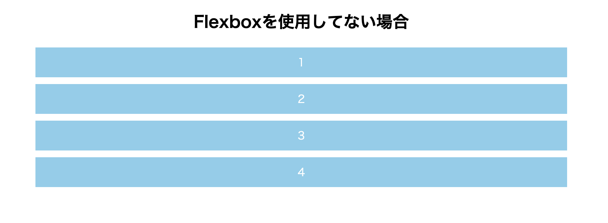

## Flexbox

## 概要
CSSはHTMLを装飾するために使用することはすでに説明しました。  

装飾には主に以下の3つがあります。
1. 要素の配置を決める
2. 要素のサイズを決める
3. 要素の見た目(色など)を決める。  

今回学習するFlexboxは**要素の配置を決める**ための
CSSです。


## ゴール
Flexbox関連の以下4つの使い方を理解する

- `display: flex`
- `flex-direction`
- `justify-content`
- `align-items`

Flexboxには非常に多くのプロパティが存在しますが、  
最低限上記4つを使用すればある程度のWebサイトは作成できます。

## 使い方
まずは基本的な使い方です。  

文末に使用例のリンクと、コードを貼っているので、まずは文章を読んで、  
なんとなく概念を理解してください。  

Flexboxには**Flexコンテナ**と**Flexアイテム**があります。  
Flexコンテナとは  CSSで、**display: flexをつけたHTMLのタグのこと**、  
Flexアイテムとは**Flexコンテナ**の子要素のことです。  

では、`display:flex`をつけると、何ができるかというと、  
Flexアイテムを、Flexコンテナ内で、**縦横自由に配置**することができます。  
HTMLの例でブロック要素は縦に並ぶということを説明しましたが、  
ブロック要素であっても横に並べることができます。  
`display:flex`は自分が動かしたい要素の親要素につけます。  
また、`display: flex`をつけると要素は横並びになります。

### 例
以下のようなhtmlがあった場合に、  
Flexboxを使用してない(①)場合、縦に並びますが、  
Flexboxを使用する(②)と横並びになります。  

また、横並びになった要素を自由に動かすことができます。  
※背景の色などは別でCSSをつけています。

```html
<!-- ① -->
<h2>Flexboxを使用してない場合</h2>
<div>
    <div class="box">1</div>
    <div class="box">2</div>
    <div class="box">3</div>
    <div class="box">4</div>
</div>

<!-- ② -->
<h2>display: flexを使用(要素が横並びになる)</h2>
<div class="flex1">
    <div class="box">1</div>
    <div class="box">2</div>
    <div class="box">3</div>
    <div class="box">4</div>
</div>
```

### ①  


### ②  


配置を動かしたいが、並び順は縦のままにしたい場合はFlexコンテナに`flex-direction: column`をつけます。
そうすると、並び順は縦並びのままFlexアイテムを自由に動かすことができます。

最後に、配置ですが、中央によせたい、両端によせたいといったことに使用するのが、
`justify-content`と`align-items`です。
それぞれのプロパティで上下の位置、左右の位置を決めます。
`flex-direction`の値によって、どちらが上下左右の位置を決めるのか変わります。

|                |flex-direction: row  |flex-direction: column  |
|---             |---                  |---                     |
|justify-content |左右                 |上下                    |
|align-items     |上下                 |左右                    |

※`flex-direction`を使ってない場合は、`flex-direction: row`と同じです。
**上記の各プロパティは全てFlexコンテナ**につけます。

また、Flexコンテナは子要素(Flexアイテム)の位置を自由に動かすことができますが、
孫要素(Flexアイテムの子要素)を動かすことはできません。
動かしたい場合は、動かしたい要素の親要素に`display: flex`をつけます。
そのため、ある要素のFlexアイテムが、別のある要素のFlexコンテナになることもあります。

## まとめ
### `display: flex`
- つけた要素がFlexコンテナになる
- 子要素(Flexアイテム)を自由に動かすことができる

### `flex-direction`
- Flexコンテナにつける
- Flexアイテムの並び順を縦にするか横にするかを決める
- `flex-direction: column`の場合は縦並び
- `flex-direction: row`、またはついてない場合は横ならび

### `justify-content`
- Flexコンテナにつける
- `flex-direction: row`、またはついてない場合は**左右**の位置を決める
- `flex-direction: column`の場合は**上下**の位置を決める

### `align-items`
- Flexコンテナにつける
- `flex-direction: row`、またはついてない場合は**上下**の位置を決める
- `flex-direction: column`の場合は**左右**の位置を決める

他にもプロパティはたくさんあるので、  
興味がある方はGoogleで「Flexbox」などで検索してみてください。

## 使用例
使用例は以下のWebサイトを確認してください。  
[サンプルサイト](https://nexseed.netlify.com/html_css/flexbox/)


## コード
使用例に記載してるHTMLとCSSは以下です。  
ご自身のPCで確認される場合は、  
`question/html_css/flexbox`フォルダをご利用ください。  
HTMLは`index.html`に、CSSは`style.css`に記述してください。  
`index.html`をgoogle chromeにドラッグアンドドロップすることでブラウザでの確認は行えます。 

<details><summary>index.html</summary>
<div>

```html
 <!DOCTYPE html>
 <html>
 <head>
    <meta charset="UTF-8">
    <title>Flexbox</title>
    <link rel="stylesheet" href="style.css">
 </head>
 <body>
    <h1>Flexboxサンプル</h1>
    <h2>Flexboxを使用してない場合</h2>
    <div>
        <div class="box">1</div>
        <div class="box">2</div>
        <div class="box">3</div>
        <div class="box">4</div>
    </div>
    <hr>

    <h2>display: flexを使用(要素が横並びになる)</h2>
    <div class="flex1">
        <div class="box">1</div>
        <div class="box">2</div>
        <div class="box">3</div>
        <div class="box">4</div>
    </div>
    <hr>

    <h2>display: flex + justify-contentで左右の位置を調整(中央寄せ)</h2>
    <div class="flex2">
        <div class="box">1</div>
        <div class="box">2</div>
        <div class="box">3</div>
        <div class="box">4</div>
    </div>
    <hr>

    <h2>display: flex + justify-contentで左右の位置を調整(幅を均等にする)</h2>
    <div class="flex3">
        <div class="box">1</div>
        <div class="box">2</div>
        <div class="box">3</div>
        <div class="box">4</div>
    </div>
    <hr>

    <h2>display: flex + align-itemsで上下の位置を調整(中央寄せ)</h2>
    <div class="flex4">
        <div class="box">1</div>
        <div class="box">2</div>
        <div class="box">3</div>
        <div class="box">4</div>
    </div>
    <hr>

    <h2>display: flex + flex-direction:columnで縦並び</h2>
    <div class="flex5">
        <div class="box">1</div>
        <div class="box">2</div>
        <div class="box">3</div>
        <div class="box">4</div>
    </div>
    <hr>

    <h2>display: flex + flex-direction:columnで縦並び + justify-contentで上下の位置を調整(下寄せ)</h2>
    <div class="flex6">
        <div class="box">1</div>
        <div class="box">2</div>
        <div class="box">3</div>
        <div class="box">4</div>
    </div>
    <hr>

    <h2>display: flex + justify-content:centr + align-items:centerで上下左右の位置を調整(上下左右中央)</h2>
    <div class="flex7">
        <div class="box">1</div>
        <div class="box">2</div>
        <div class="box">3</div>
        <div class="box">4</div>
    </div>
    <hr>

 </body>
 </html>
```

</div>
</details>
<br>

<details><summary>style.css</summary>
<div>

```css
body {
    margin: 0 auto;
    width: 800px;
    text-align: center;
}

hr {
    margin: 80px 0;
}

.box {
    background-color: skyblue;
    color: white;
    padding: 10px;
    margin: 10px;
}

.flex1 {
    display: flex;
}

.flex2 {
    display: flex;
    justify-content: center;
}

.flex3 {
    display: flex;
    justify-content: space-around;
}

.flex4 {
    display: flex;
    height: 300px;
    background-color: lightgray;
    align-items: center;
}

.flex5 {
    display: flex;
    flex-direction: column;
}

.flex6 {
    display: flex;
    height: 300px;
    background-color: lightgray;
    flex-direction: column;
    justify-content: flex-end;
}

.flex7 {
    display: flex;
    height: 300px;
    background-color: lightgray;
    justify-content: center;
    align-items: center;
}
 
```

</div>
</details>
<br>


