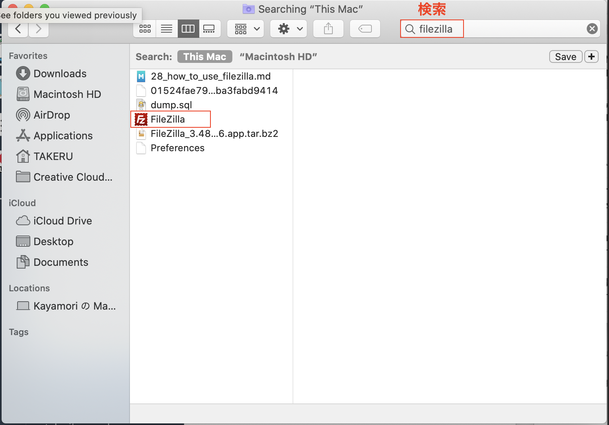

# インターネットでウェブサイト公開する方法

ここではレンタルサーバーを借りて、インターネット上で公開する方法を公開します。

以下の手順で進めていきます。
1. レンタルサーバーへの登録
2. FTPツールのインストール
3. FTPツールを使ってサーバーにアップロードする
4. 動作確認

 

## 1. レンタルサーバーへの登録

今回はロリポップというレンタルサーバーを利用します。

 
 

プランを選べますが、今回は無料体験を利用するので、どのプランでも構いません。解説の中では、スタンダードを選びました。

 
 

ドメインを作成します。
ドメインとは、URLの中の文字です。
ドメインには有料のものと無料のものがありますが、ビジネスで使うのでなければ無料のもので十分です。
無料の場合、画像のように`boyfriend.jp`など提供する側が決めた文字が入ってしまいます。

 
 

登録を進めていき、ロリポップにログインすると以下のような画面になります。
ユーザー設定　→　アカウント情報をクリックしてください。
　

 
 

アカウント情報を開くと様々な情報が表示されます。この後必要な情報は、画像の中で「A、B、C」で示した箇所です。

## 2. FTPツールのインストール

FTPとはFile Transfer Protocolの略で、パソコンから、サーバーへとファイルをアップロードするために使うツールです。
今回はFileZillaというツールを利用します。
以下のリンクからFileZillaのページと飛んでください。
 
https://filezilla-project.org/

Macの方は左を、Windowsの方は右の四角をクリックします。

 
 

緑色のボタンをクリックするとダウンロードが開始されます。

 
 

## 3. FTPツールを使ってサーバーにアップロードする

ダウンロードが完了したら、filezillaを検索して、見つかったFileZillaのアプリを開きましょう。

 
 

アプリを起動すると以下のような画面になります。
左上のアイコンをクリックしてください。

 
 
すると、さらに小さいウィンドウが開かれます。
画像の赤い文字で示した箇所を番号順に追ってください。
ABCで示した空欄には、先ほどのロリポップのアカウント情報に対応させてください。

1. (上ですでにクリックしました)
2. 「New Site」をクリック。
3. 名前を入力（任意の名前でOK）
4. 情報の入力
   1. Host　= A（FTPサーバー）
   2. User = B（FTP・WebDAVアカウント）
   3. Password = C（FTP・WebDAVパスワード）
5. 「Connect」をクリック
 

 
 

5. アップロードしたいフォルダをドラッグ＆ドロップします。これでアップロードは完了です。

 
 

## 4. 動作確認

実際にネット上で確認されていることを確認しましょう。
Google ChromeでウェブサイトのURLを入力します。

ロリポップのアカウント情報内にウェブサイトのアドレスがあるので、クリックしてください。

 
 

「/」の後ろにFileZillaでアップロードしたフォルダ名を入力すると、先ほどアップロードしたウェブサイトを確認することができます。

 
 

無料期間が終了すると、URLは無効になってしまうので、維持したい場合は有料会員に切り替えてください。
 

以上で、インターネットでウェブサイト公開する方法の解説は終わりです。

